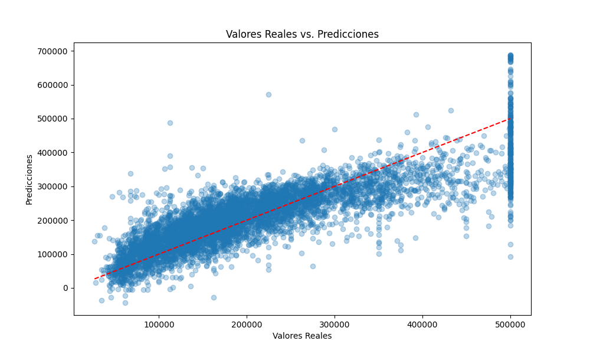

# Introducción
Este proyecto representa mis primeros pasos en el mundo de Data Science y el Machine Learning. Para comenzar, he decidido utilizar el algoritmo de regresión lineal debido a su curva de aprendizaje accesible.

He elegido el dataset de precios de viviendas en California, disponible en Kaggle, como punto de partida para este proyecto. Este conjunto de datos proporciona una excelente oportunidad para explorar y aplicar técnicas de regresión en un contexto real.
- **Link del dataset**: [Dataset de Kaggle](https://www.kaggle.com/datasets/camnugent/california-housing-prices/data)

# Tech Stack
- **Python**: La versión utilizada en este proyecto es la 3.11.3.
- **Scikit-learn**
- **Pandas**
- **Numpy**
- **Matplotlib**

# Características
El modelo de regresión lineal permite predecir el precio de una vivienda basado en una serie de atributos de entrada. Este enfoque proporciona una forma sencilla y efectiva de relacionar las características de una propiedad con su valor de mercado.

# Proceso
Empecé este proyecto con concocimientos bastante básicos sobre Data science y Machine learning. Sin embargo, a lo largo de los días, investigué y aprendí mucho, lo cual fue una experiencia muy emocionante al introducirme en un área totalmente nueva para mí. Uno de los retos que encontré fue comprender las correlaciones entre las características del dataset y cómo podía generar nuevas características que aportaran más contexto al modelo, entre otros desafíos.

# Aprendizajes
Durante este proyecto realmente aprendí bastantes cosas, dentro de las que quiero destacar se encuentran:
1. **Los fundamentos matemáticos y estadísticos de la regresión lineal**
2. **Minímo error cuadrático medio**
3. **Transformaciones logarítmicas**
4. **Valores atípicos**
5. **Evaluación de resultados**

# Mejoras
Siendo este mi primer proyecto de data science y machine learning, reconozco que hay múltiples áreas en las que puedo mejorar. Una de ellas es el feature engineering, ya que, con más conocimientos, podría extraer y crear características más informativas a partir de los datos existentes. También considero que emplear un algoritmo más avanzado, como Random Forest, podría incrementar significativamente la precisión del modelo. Mi próximo objetivo será aprender sobre el algoritmo Random Forest y comparar sus resultados con los del modelo actual.

# Pasos para Inicializar el Proyecto

1. **Instalar los paquetes:**
    ```sh
    pip install
    `

2. **Ubicarse en la carpeta src:**
    ```sh
    cd src
    ```

3. **Ejecutar el archivo para transformar el conjunto de datos:**
    ```sh
    python .\data_transformer.py
    ```

4. **Entrenar el modelo:**
    ```sh
    python .\model_builder.py
    ```

5. **Realizar pruebas y evaluar al modelo:**
    ```sh
    python .\model_evaluator.py
    ```

